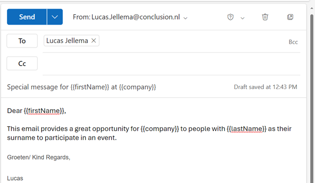
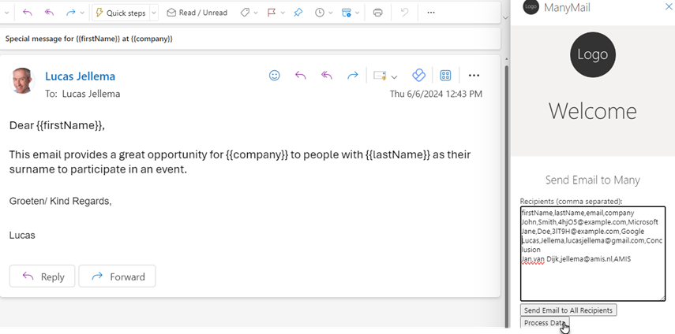
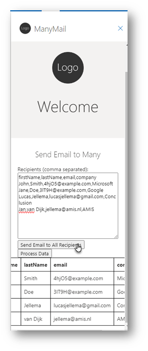
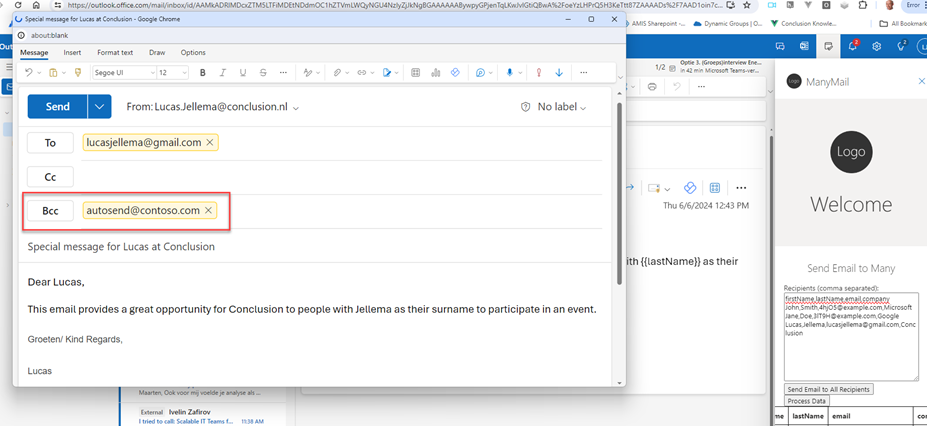
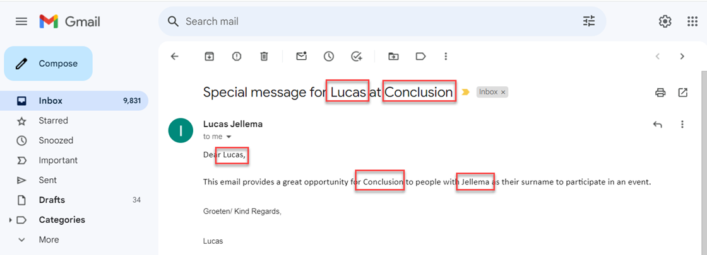
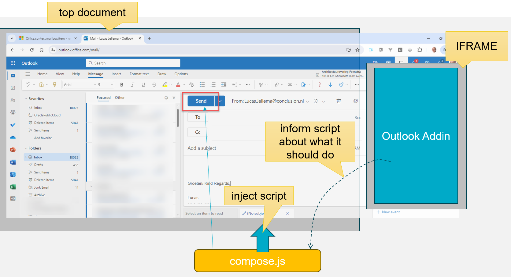
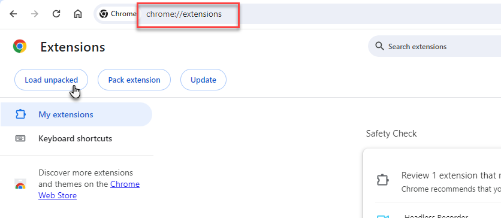
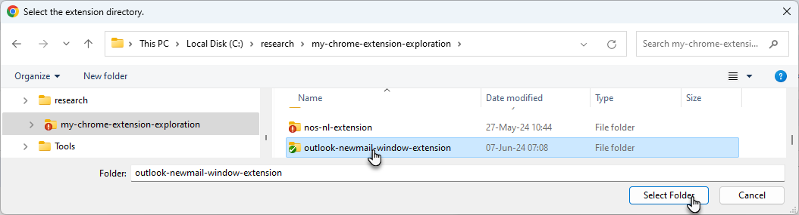
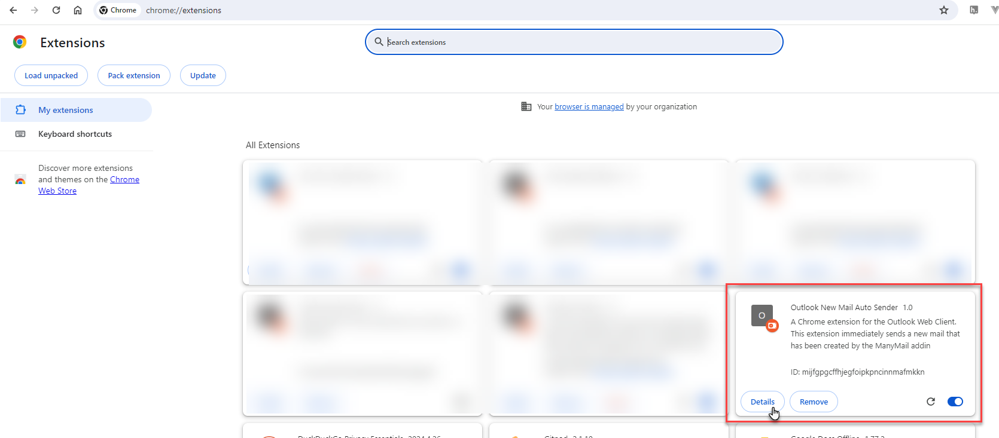

# MailMany Outlook Addin - Send Personalized Mails to a (large) number of Recipients

My main objective when I started dabbling in Outlook Addins was to create a tool that allows me to easily send mails to a potentially large group of people with personal elements - such as their first name and company name in addition to their mail address. Something like (Word's) MailMerge - but then much better. I want to run it entirely from within Outlook (and not create a document in Word). I did reach that goal and this article shows the result achieved and explains how I did it. It was quite a bit harder than I anticipated. For one: the JavaScript API for Office allows addins to do many things, including reading, creating and saving email messages. But it does not allow an email to be sent! In this article how I worked around the limitation of not being allowed to send an email in order to send many mails. One clue: the workaorund only works for the Outlook Web Client. A second clue: browser extension. More on that later.

This article is more about how to *create* an Outlook addin than about how to use or even suggesting that you should use my addin. You will learn about some of the challenges I encountered and the workarounds I implemented. As an addin, it is not great - just a prototype. It works and it can provide some inspiration for functionality for you to implement.

## Using the Addin

Once the Addin is installed (and the Browser Extension is enabled), I can send a personalized email to many recipients by going through these steps:
* write an email with placeholders that can be personalized (a placeholder is written as `{{property}}`)

* send the email to myself
* open the email in read mode
* activate the addin, open the taskpane and paste the recipients data in CSV format

* press the *Process Data* button to process the data and get a structured overview 
  
 * When the data is correct, press the button *Send email to All Recipients*
 * The addin will now open new windows for all all recipients, containing the personalized emails
  

In the Outlook desktop client, you have to send each mail message manually. In the web client, there is an additional automation available: The addin defines a special bcc value: autosend@contoso.com. If you use the Outlook WebClient and you have installed and enabled the Chrome Extension Outlook New Mail Auto Sender (see below), then this value will trigger the automatically sending of the mail message (the extension will locate and click the Send button in the new message form). 

 * the Chrome Browser extension will identify each of these windows and it will send the emails
   

## Implementation of the Outlook Addin


## The Chrome Extension - To Actually Send Off all those New Mail Messages
As I mentioned before, the Office API does not allow the email to be sent. You can create it, edit it, inspect it and save it. But you can not send it. To send an email, you need to use the EWS (Exchange Web Services) or REST API (soon to be discontinued) or Microsoft Graph API. In order to do the latter: the Addin needs to be registered with Azure App Registrations and in order to do that, you need to have the right privileges in the Microsoft account. I suppose that is the proper route, but one that I leave for later. Right now I want to my Addin to just send those emails: it runs in the same context as I do and I can send emails, so my Addin, working on my behalf, can do so too.

I tried to make the Addin click on the Send button. After all, it is just an HTML Document element and it can programmatically be activated. However, the Addin runs in a IFRAME and from the IFRAME, I cannot reach the parent document and its elements.

That gave me an idea however: even though the Addin cannot do it, any script running in the context of main document would be able to. And I had been looking at developing Chrome Browser Extensions, that can have JavaScript executed in the context of the main document.



At least for the Outlook Web Client running in Chrome Browser, I can create an extension that attaches itself to the Outlook document, finds the Send button and clicks it. At least, when it knows that it is dealing with an email generated by the Addin and ready to be sent off.

I have looked at communication from the Addin IFRAME with a message sent through the parent document that can signal instructions to listeners (`parent.postMessage`). But I can do it in a much simpler way. If the generated email contains the signal itself, it can be found by the browser extension and used as a trigger to send the email. If the signal is missing, the extension does nothing. So the addin sets a Bcc recipient with the value *autosend@contoso.com*. It is meaningless and invisible but it is the sign for the extension to kick in. 


The code of the extension (file `content.js`):
```
console.log("Outlook New Mail Extension loaded");

const inspectIfNewMail = () => {
  // this is a bit brittle: relying on the aria-label value
  const bccDiv = document.querySelector('[aria-label="Bcc"]');
  if (bccDiv && bccDiv.textContent.includes("autosend@contoso.com")) {
    const sendButton = document.querySelector('[aria-label="Send"]');
    if (sendButton) {
      setTimeout(() => { sendButton.click(); }, 1500); // allow some time for the new mail to be fully constructed from the Addin
    }
  }
}

setTimeout(() => {
  inspectIfNewMail();
}, 1000); // it takes some time for the document to be ready to be inspected (the bcc field to be set), hence this timeout  
```

Note how the extension waits a little while (setTimeOut) before it tries to access the *Bcc* field. It turns out that even when the document is loaded, it still takes a while for that field to have its value. Hence the little pause.

Function *inspexctIfNewMail* locates the *Bcc* field based on its *aria-label* value. Looking for the field in this manner feels a little brittle, but extensions often have to use such queries and I will just have to look for updates in to the Outlook Web Client when the extension stops working.

If the text content of the bcc field turns out to contain the signal from the Outlook Addin - "autosend@contoso.com" - then the function locates the Send button - again using the somewhat brittle approach of looking for the aria-label. When the button is found, it is clicked - after another pause to make sure the new mail is fully constructed. 

### About Blank - new window
One challenge I ran into: the new mail is opened in a new window. This window has *about:blank* as its URL, not the expected *https://outlook.office.com/** string. After quite some exploration, I learned that I can also inject the extension's script into the about:blank document if I add the *match_about_blank* setting in the *manifest.json*:

```
{
    "manifest_version": 3,
    "name": "Outlook New Mail Auto Sender",
    "version": "1.0",
    "description": "A Chrome extension for the Outlook Web Client. This extension immediately sends a new mail that has been created by the ManyMail addin (looking for the special bcc value)",
      "permissions": [
        "tabs","activeTab","scripting",
        "webNavigation"
      ],
      "content_scripts": [
        {"matches": ["https://outlook.office.com/*"],
          "js": ["content.js"],
          "all_frames": true,
          "match_about_blank": true,
          "run_at": "document_end"
        }
      ],
      "host_permissions": [
        "<all_urls>"
      ]
}
```

Because the about:blank window still has https://outlook.office.com/* as its original origin, these settings ensure that `content.js` is loaded when the new mail message window is opened. As far as I can tell, the *webNavigation* permission is also required, it seems the extension does not work without it. 


### Load the Chrome Browser Extension
To add the extension to the Chrome Browser, nothing special needs to be done. 

* Open the Chrome Extensions page at `chrome://extensions/`
* Click on Load Unpacked

* Select the local folder that contains the `manifest.json` file for the extension

  
  
The extension is loaded from the file system and added (copied) to your local browser configuration. The extension is presented on the page:

You can inspect the details - although there is not much to be learned about the extension. Note: if you make any changes in the configuration or source code, this where you can reload the extension to have the changes active in the browser.


