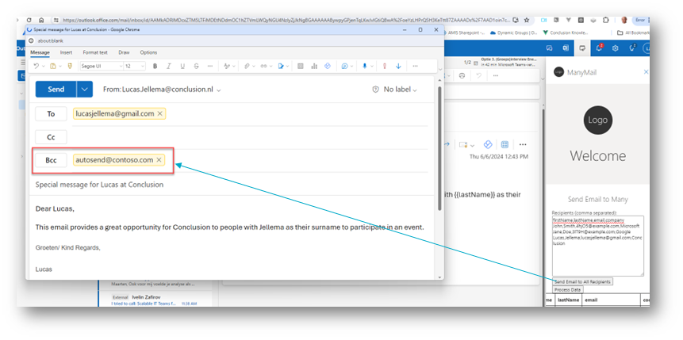

# MailMany Outlook Addin - Send Personalized Mails to a (large) number of Recipients

My main objective when I started dabbling in Outlook Addins was to create a tool that allows me to easily send mails to a potentially large group of people with personal elements - such as their first name and company name in addition to their mail address. Something like (Word's) MailMerge - but then much better. I want to run it entirely from within Outlook (and not create a document in Word). I did reach that goal and this article shows the result achieved and explains how I did it. It was quite a bit harder than I anticipated. For one: the JavaScript API for Office allows addins to do many things, including reading, creating and saving email messages. But it does not allow an email to be sent! In this article how I worked around the limitation of not being allowed to send an email in order to send many mails. One clue: the workaorund only works for the Outlook Web Client. A second clue: browser extension. More on that later.

This article is more about how to *create* an Outlook addin than about how to use or even suggesting that you should use my addin. You will learn about some of the challenges I encountered and the workarounds I implemented. As an addin, it is not great - just a prototype. It works and it can provide some inspiration for functionality for you to implement.

All code discussed in this article is available in this GitHub Repository: https://github.com/lucasjellema/outlook-addin/tree/main/ManyMail .

## Using the Addin

Once the Addin is installed (and the Browser Extension is enabled), I can send a personalized email to many recipients by going through these steps:
* write an email with placeholders that can be personalized (a placeholder is written as `{{property}}`)

* send the email to myself
* open the email in read mode
* activate the addin, open the taskpane and paste the recipients data in CSV format

The data looks like this:
```
firstName,lastName,email,company
John,Smith,4hjO5@example.com,Microsoft
Jane,Doe,3lT9H@example.com,Google
```
The first row contains the field names - these should correspond with the names of the placeholders in the email. One field is mandatory: `email`. This field is used to derive the value for `to` - the recipient of the email message. For every recipient there should be row in the data set (on its own new line).

* press the *Process Data* button to process the data and get a structured overview 
  
 * When the data is correct, press the button *Send email to All Recipients*
 * The addin will now open new windows for all all recipients, containing the personalized emails
  

In the Outlook desktop client, you have to send each mail message manually. In the web client, there is an additional automation available: The addin defines a special bcc value: autosend@contoso.com. If you use the Outlook WebClient and you have installed and enabled the Chrome Extension Outlook New Mail Auto Sender (see below), then this value will trigger the automatically sending of the mail message (the extension will locate and click the Send button in the new message form). 

 * the Chrome Browser extension will identify each of these windows and it will send the emails
   

## Implementation of the Outlook Addin
I will not go over the details of implementing an Outlook Addin, Plenty of sources cover that subject. I will focus on what is special for this addin. 

As per usual, the main moving parts for the addin are the manifest file and the common web resources html, css and js:
* manifest.xml - the configuration of the addin, guiding Outlook on how to fetch resources and to initialize the addin
* taskpane.html - the (static) UI for the addin 
* taskpane.css
* taskpane.js - the logic of the addin: this is where the magic mostly happens
* some icons (though I have not bothered to come up my own icons and for now the addin ships with the standard ones)

### Manifest 

The manifest.xml file tells Outlook under which conditions the addin should be made available and what it should be allowed to do. It also indicates the labels, icons, sources to be used. 

Why not the unified JSON manifest format you may wonder? Simply because I could not get it to upload in the Addin management page in Outlook Web Client. I seem to only be able to get the XML format going.

In this case, the manifest specifies for permissions and rules:
```
<Hosts>
    <Host Name="Mailbox"/>
  </Hosts>
  <Requirements>
    <Sets>
      <Set Name="Mailbox" MinVersion="1.1"/>
    </Sets>
  </Requirements>
  <FormSettings>
    <Form xsi:type="ItemRead">
      <DesktopSettings>
        <SourceLocation DefaultValue="https://localhost:3000/taskpane.html"/>
        <RequestedHeight>250</RequestedHeight>
      </DesktopSettings>
    </Form>
  </FormSettings>
  <Permissions>ReadWriteItem</Permissions>
  <Rule xsi:type="RuleCollection" Mode="Or">
    <Rule xsi:type="ItemIs" ItemType="Message" FormType="Read"/>
    <Rule xsi:type="ItemIs" ItemType="Message" FormType="Edit"/>
  </Rule>
```

The extension point:
```
<Hosts>
      <Host xsi:type="MailHost">
        <DesktopFormFactor>
          <ExtensionPoint xsi:type="MessageReadCommandSurface">
            <OfficeTab id="TabDefault">
              <Group id="msgReadGroup">
                <Label resid="GroupLabel"/>
                <Control xsi:type="Button" id="msgReadOpenPaneButton">
                  <Label resid="TaskpaneButton.Label"/>
                  <Supertip>
                    <Title resid="TaskpaneButton.Label"/>
                    <Description resid="TaskpaneButton.Tooltip"/>
                  </Supertip>
                  <Icon>
                    <bt:Image size="16" resid="Icon.16x16"/>
                    <bt:Image size="32" resid="Icon.32x32"/>
                    <bt:Image size="80" resid="Icon.80x80"/>
                  </Icon>
                  <Action xsi:type="ShowTaskpane">
                    <SourceLocation resid="Taskpane.Url"/>
                  </Action>
                </Control>
              </Group>
            </OfficeTab>
          </ExtensionPoint>
        </DesktopFormFactor>
      </Host>
    </Hosts>
```
The resources are the standard ones.

### The Taskpane UI

File taskpane.html - supported by taskpane.css - define the layout of the addins UI. It is nothing very special.

(this prototype does the job, nothing more than that)

Key parts in the HTML file
```
<head>
...
    <title>Conclusion ManyMail Task Pane Add-in</title>
    <!-- Office JavaScript API -->
    <script type="text/javascript" src="https://appsforoffice.microsoft.com/lib/1.1/hosted/office.js"></script>
    <link href="taskpane.css" rel="stylesheet" type="text/css" />
</head>
<body class="ms-font-m ms-welcome ms-Fabric">
    <header class="ms-welcome__header ms-bgColor-neutralLighter">
        
    </header>
    <main id="app-body" class="ms-welcome__main" style="display: none;">
        <h2 class="ms-font-xl">Send Email to Many</h2>
        <form id="emailForm">
            <label for="recipients">Recipients (comma separated):</label>
            <textarea id="recipients" name="recipients" rows="4" cols="40"></textarea>
            <button type="button" id="sendEmails">Send Email to All Recipients</button>
            <button type="button" id="run">Process Data</button>
        </form>
        <h3>Place holders in email</h3>
        <div id="placeholders"></div>
        <div id="tableContainer"></div>       
    </main>
    <script src="taskpane.js"></script>
</body>
```
The `<script>` element to import taskpane.js is not generated by the Yeoman Office Addin generator. For local development, it is not needed. However, if you want - as I do - to load the addin from a static web server such as GitHub pages, then this element is crucial. 

The first `<script>` element is crucial in every Outlook and indeed every Office Addin: it is where the API to all Office functionality is made available to the Addin.


### The Taskpane Logic

File `taskpane.js` contains the logic. It does a few things:
* turn CSV formatted data into a JavaScript data structure, ready for personalizing emails
* present processed data in an HTML table layout for inspection (though not yet editing)
* show all placeholder in the current email (so the user can align the CSV data with those placeholders)
* create a personalized message from the current email document (by replacing placeholders in subject and body)
* create a new message window based on the personalized message for each of the recipients (and sets the bcc field) 

The logic is not spectacular and I had some AI help with it. The crucial elements:

When the button is clicked to send the emails, function sendEmails is called. It processes all recipients and for each creates the new mail message window with the personalized subject and body and the right recipient: 
```
function sendEmails() {
  Office.context.mailbox.item.body.getAsync(Office.CoercionType.Html, (result) => {
    if (result.status === Office.AsyncResultStatus.Succeeded) {
      const emailBody = result.value; // get the body from the current mail in the read pane
      const subject = Office.context.mailbox.item.subject; // the the subject from the current mail message
      recipientsData.forEach((recipient, index) => {
        const personalizedBody = personalize(emailBody, recipient)
        const personalizedSubject = personalize(subject, recipient)
        // wait some time between mails
        setTimeout(() => {
          prepareForSendEmail(recipient.email, personalizedSubject, personalizedBody)
        }, index * 1200); 
      });
    }
  });
}

function prepareForSendEmail(recipient, subject, body) {
  Office.context.mailbox.displayNewMessageFormAsync({
    toRecipients: [recipient], // Copies the To line from current item
    bccRecipients: ["autosend@contoso.com"], // signal to Chrome Extension that it can automatically send this mail
    subject: subject,
    htmlBody: body
  }, (asyncResult) => {
  })
}
```

Note the call to function `displayNewMessageFormAsync` in the Office API. This call causes the window to be created for the new mail. Note the `bccRecipients` property: it is set to the signal value *autosend@contoso.com*. When the addin is used in the Outlook Web Client *and* the Chrome Extension (discussed below) is active, then this signal value will inform the extension that it should send the email (by clicking the *Send* button, just like the end user would)

Function `sendEmails` operates on the data set recipientsData. This data set is constructed when the button Process Data is pressed, to process the CSV data pasted/edited in the textarea.

```
let recipientsData

const processData = () => {
  const recipientsTextarea = document.getElementById('recipients');
  const data = recipientsTextarea.value;
  const parsedData = csvToObjectArray(data);
  recipientsData = parsedData
  const tableContainer = document.getElementById('tableContainer');
  tableContainer.innerHTML = ''; // Clear previous table
  const table = createTableFromData(parsedData);
  tableContainer.appendChild(table);
};

function csvToObjectArray(csvString) {
  const rows = csvString.trim().split('\n');
  const headers = rows[0].split(',');
  return rows.slice(1).map(row => {
    const values = row.split(',');
    let obj = {};
    values.forEach((value, index) => {
      obj[headers[index]] = value;
    });
    return obj;
  });
}

// Function to create an HTML table from an object array
function createTableFromData(data) {
  const table = document.createElement('table');
  const thead = document.createElement('thead');
  const tbody = document.createElement('tbody');
  const headerRow = document.createElement('tr');
  Object.keys(data[0]).forEach(key => {
    const th = document.createElement('th');
    th.textContent = key;
    headerRow.appendChild(th);
  });
  thead.appendChild(headerRow);
  data.forEach(item => {
    const row = document.createElement('tr');
    Object.values(item).forEach(value => {
      const td = document.createElement('td');
      td.textContent = value;
      row.appendChild(td);
    });
    tbody.appendChild(row);
  });

  table.appendChild(thead);
  table.appendChild(tbody);
  return table;
}
```
The buttons in the taskpane are only available for execution if the Office API has successfully initialized. This check is handled in the first line of code of taskpane.js
```
Office.onReady((info) => {
  if (info.host === Office.HostType.Outlook) {
    document.getElementById("sideload-msg").style.display = "none";
    document.getElementById("app-body").style.display = "flex";
    document.getElementById("run").onclick = processData;
    document.getElementById("sendEmails").onclick = sendEmails;
    findPlaceHolders()
  }
});

// find all unique occurrences of {{}} in the subject and body
function findPlaceHolders() {
  Office.context.mailbox.item.body.getAsync(Office.CoercionType.Html, (result) => {
    if (result.status === Office.AsyncResultStatus.Succeeded) {
      const subject = Office.context.mailbox.item.subject;
      const body = result.value;
      const regex = /\{\{.*?\}\}/g;
      const uniqueSubjectMatches = [...subject.matchAll(regex)].map(match => match[0]);
      const uniqueBodyMatches = [...body.matchAll(regex)].map(match => match[0]);
      const uniqueMatches = [...new Set([...uniqueSubjectMatches, ...uniqueBodyMatches])];
      document.getElementById("placeholders").innerHTML = "{{email}}, " + uniqueMatches.join(", ");
    }
  });
}
```
The call to `findPlaceHolders` provides a little help to the user: the current email is scanned for all occurrences of {{somestring}}. The unique values of *someString* are shown in the taskpane, to instruct the user on the field names in the CSV data.  


### Installing the Addin
This Addin can be used from your Addin development environment - as described in this tutorial [Build your first addin](https://learn.microsoft.com/en-us/office/dev/add-ins/quickstarts/outlook-quickstart?tabs=yeomangenerator). This allows you to quickly get going with modiyfing the addin to your liking.

If you just want to try out the addin, see it in action, then there is an easier way.

* download the manifest file that references the GitHub Pages deployment of the addin
* sideload this manifest file in Outlook

The first step: download the manifest file from [github.com/lucasjellema/outlook-addin/blob/main/ManyMail/manifest_githubpages.xml](https://github.com/lucasjellema/outlook-addin/blob/main/ManyMail/manifest_githubpages.xml). You may want to inspect this file to see which resources it references and which permissions it requires. You can then also verify those resources (taskpane.html, taskpane.js).

The second step:
* In your preferred browser, go to https://aka.ms/olksideload. Outlook on the web opens, then the Add-Ins for Outlook dialog appears after a few seconds.
* Go to My Addins. Click on *Add a custom addin* and click on *Add from File* in the dropdown menu 
  
* Select the manifest.xml file for the Many Mail addin
  
* The Addin is installed. 

* When you next run Outlook - either in the desktop or in a fresh web client - the addin will be available whenever you are reading an email 

Note: when you want to remove the Addin, go once more to  https://aka.ms/olksideload and click on My Addins. Then click on the three dots (elipsis) for the addin and select *Remove* from the dropdown menu.    


## The Chrome Extension - To Actually Send Off all those New Mail Messages
As I mentioned before, the Office API does not allow the email to be sent. You can create it, edit it, inspect it and save it. But you can not send it. To send an email, you need to use the EWS (Exchange Web Services) or REST API (soon to be discontinued) or Microsoft Graph API. In order to do the latter: the Addin needs to be registered with Azure App Registrations and in order to do that, you need to have the right privileges in the Microsoft account. I suppose that is the proper route, but one that I leave for later. Right now I want to my Addin to just send those emails: it runs in the same context as I do and I can send emails, so my Addin, working on my behalf, can do so too.

I tried to make the Addin click on the Send button. After all, it is just an HTML Document element and it can programmatically be activated. However, the Addin runs in a IFRAME and from the IFRAME, I cannot reach the parent document and its elements.

That gave me an idea however: even though the Addin cannot do it, any script running in the context of main document would be able to. And I had been looking at developing Chrome Browser Extensions, that can have JavaScript executed in the context of the main document.


At least for the Outlook Web Client running in Chrome Browser, I can create an extension that attaches itself to the Outlook document, finds the Send button and clicks it. At least, when it knows that it is dealing with an email generated by the Addin and ready to be sent off.

I have looked at communication from the Addin IFRAME with a message sent through the parent document that can signal instructions to listeners (`parent.postMessage`). But I can do it in a much simpler way. If the generated email contains the signal itself, it can be found by the browser extension and used as a trigger to send the email. If the signal is missing, the extension does nothing. So the addin sets a Bcc recipient with the value *autosend@contoso.com*. It is meaningless and invisible but it is the sign for the extension to kick in. 



The code of the extension (file `content.js`):
```
console.log("Outlook New Mail Extension loaded");

const inspectIfNewMail = () => {
  // this is a bit brittle: relying on the aria-label value
  const bccDiv = document.querySelector('[aria-label="Bcc"]');
  if (bccDiv && bccDiv.textContent.includes("autosend@contoso.com")) {
    try {
      const removeIconContainer = bccDiv.children[0].children[0].children[0].children[1];
       if (removeIconContainer) {
        removeIconContainer.click(); // click on the remove icon for the bcc entry
      }
    } catch (error) {
      console.log("error while resetting bcc field ", error);
    }
    const sendButton = document.querySelector('[aria-label="Send"]');
    if (sendButton) {
      setTimeout(() => { sendButton.click(); }, 1500); // allow some time for the new mail to be fully constructed from the Addin
    }
  }
}

setTimeout(() => {
  inspectIfNewMail();
}, 1000); // it takes some time for the document to be ready to be inspected (the bcc field to be set), hence this timeout  
```
The HTML element definitions that this code works with:


Note how the extension waits a little while (setTimeOut) before it tries to find and access the *Bcc* field. It turns out that even when the document is loaded, it still takes a while for that field to have its value. Hence the little pause.

Function *inspectIfNewMail* locates the *Bcc* field based on its *aria-label* value. Looking for the field in this manner feels a little brittle, but extensions often have to use such queries and I will just have to look for updates in to the Outlook Web Client when the extension stops working.

If the text content of the bcc field turns out to contain the signal from the Outlook Addin - "autosend@contoso.com" - then the function first locates the *remove icon* on the bcc entry and clicks it, to remove it before sending the enmail. Then it 
locates the Send button - again using the somewhat brittle approach of looking for the aria-label. When the button is found, it is clicked - after another pause to make sure the new mail is fully constructed. 

### About Blank - new window
One challenge I ran into: the new mail is opened in a new window. This window has *about:blank* as its URL, not the expected *https://outlook.office.com/** string. After quite some exploration, I learned that I can also inject the extension's script into the about:blank document if I add the *match_about_blank* setting in the *manifest.json*:

```
{
    "manifest_version": 3,
    "name": "Outlook New Mail Auto Sender",
    "version": "1.0",
    "description": "A Chrome extension for the Outlook Web Client. This extension immediately sends a new mail that has been created by the ManyMail addin (looking for the special bcc value)",
      "permissions": [
        "tabs","activeTab","scripting",
        "webNavigation"
      ],
      "content_scripts": [
        {"matches": ["https://outlook.office.com/*"],
          "js": ["content.js"],
          "all_frames": true,
          "match_about_blank": true,
          "run_at": "document_end"
        }
      ],
      "host_permissions": [
        "<all_urls>"
      ]
}
```

Because the about:blank window still has https://outlook.office.com/* as its original origin, these settings ensure that `content.js` is loaded when the new mail message window is opened. As far as I can tell, the *webNavigation* permission is also required, it seems the extension does not work without it. 


### Load the Chrome Browser Extension
To add the extension to the Chrome Browser, nothing special needs to be done. 

* Open the Chrome Extensions page at `chrome://extensions/`
* Click on Load Unpacked

* Select the local folder that contains the `manifest.json` file for the extension

  
  
The extension is loaded from the file system and added (copied) to your local browser configuration. The extension is presented on the page:

You can inspect the details - although there is not much to be learned about the extension. Note: if you make any changes in the configuration or source code, this where you can reload the extension to have the changes active in the browser.
