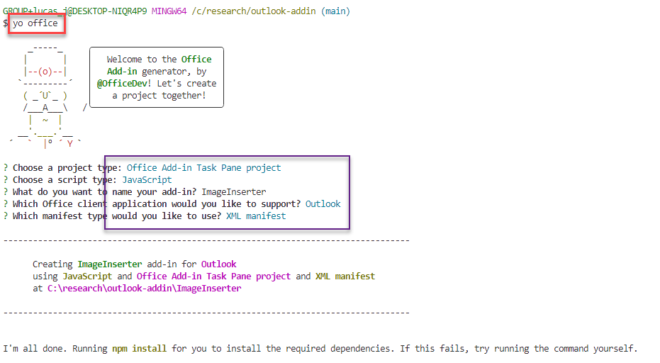
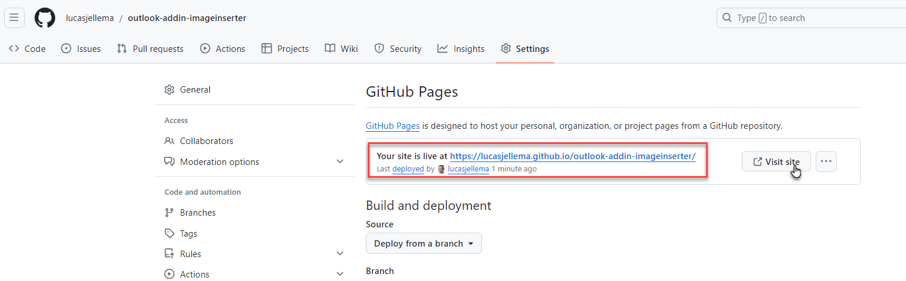
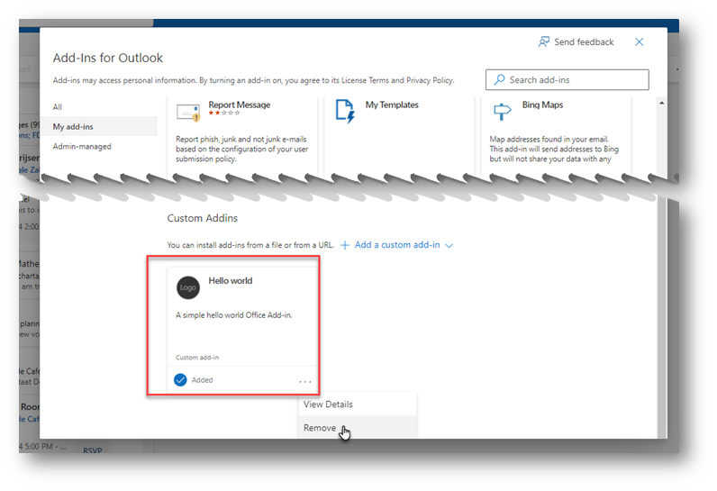

# The Image Inserter Outlook Addin

This article describes the creation of a simple Outlook Addin. It acts on a message that is being composed in the message editor. When the Addin is activated, it will cause an image - and a very pretty one! - to be inserted in the message under construction at the position of the cursor. It will provide a starting point for much more complex and interesting Addins later on.

The steps to go through in order to create, test-run and deploy the Addin are outline below.

## Prepare your environment

Make sure you have VS Code installed. Also ensure that you have Node set up: Node.js (the latest LTS version). Visit [the Node.js site](https://nodejs.org/) to download and install the right version for your operating system. And work on a machine that has the Outlook Client installed. (note: you can work with Outlook Web Client as well, with a flow that is a little bit less smooth).

Run VS Code. Open a Terminal (I prefer the Bash terminal).

Install the latest version of Yeoman and the Yeoman generator for Office Add-ins. To install these tools globally, run the following command via the command prompt.
```
npm install -g yo generator-officenpm install -g yo generator-office
```

This is the general preparation, one time only and the same of all types of Office Addin development (including Word, Excel, Powerpoint and OneNote).


## Generate the Skaffold for the ImageInserter Addin

Run the following command to create an add-in project using the Yeoman generator. A folder that contains the project will be added to the current directory.
```
yo office
```
When prompted, provide the following information to create your add-in project.
```
Choose a project type: Office Add-in Task Pane project
? Choose a script type: JavaScript
? What do you want to name your add-in? ImageInserter
? Which Office client application would you like to support? Outlook
? Which manifest type would you like to use? XML manifest
```



The directory ImageInserter is created, with artifacts that form the Addin.


To make sure all modules are installed correctly, navigate into the new directory and run `npm install`:
```
cd ImageInserter
npm install
```


## Refine the generated default Addin

Inside VS Code, edit the file `manifest.xml`.

Update the elements ProviderName and Description with apprpriate values.

Change the ExtensionPoint element's type attribute to `MessageComposeCommandSurface` to make this addin active for new email composition.
```
<ExtensionPoint xsi:type="MessageComposeCommandSurface">
```

Add Rule element (type ItemIs)
```
    <Rule xsi:type="ItemIs" ItemType="Message" FormType="Edit"/>
```
inside the <Rule> of type RuleCollection, to make it read:
```
  <Rule xsi:type="RuleCollection" Mode="Or">
    <Rule xsi:type="ItemIs" ItemType="Message" FormType="Read"/>
    <Rule xsi:type="ItemIs" ItemType="Message" FormType="Edit"/>
  </Rule>
```
Update the file  `src/taskpane.js`: 

Add function insertImage at the end of the file:
```
function insertImage() {
  const imageDataUrl = 'https://www.thewowstyle.com/wp-content/uploads/2015/01/images-of-nature-4.jpg'
 
  // Create an HTML image element
  const imgElement = ``;

  // Insert the image HTML at the cursor position
  Office.context.mailbox.item.body.setSelectedDataAsync(
      imgElement,
      { coercionType: Office.CoercionType.Html },
      function(asyncResult) {
          if (asyncResult.status === Office.AsyncResultStatus.Succeeded) {
              console.log("Image inserted successfully.");
          } else {
              console.error("Failed to insert image: " + asyncResult.error.message);
          }
      }
  );
}
```

and change function `run` to:
```
export async function run() {
  /**
   * Insert your Outlook code here
   */

 insertImage();
}

```

## Test run the Addin

Now run `npm start`. Type `N` when asked *? Allow localhost loopback for Microsoft Edge WebView? No*

This will:
* run a web server that serves the files the addin is made up of
* add the addin to your local Outlook client, referring to localhost where the web server is providing the addin
* run Outlook - which now has the Addin enabled


Goto Outlook. Create a new Email. Start typing your message. 

When you want to insert an image: Click on the Apps icon. You will find the *ImageInserter*. 


Click on the ImageInserter. A dropdown menu pops up. 

Click on Show Taskpane.

The taskpane (defined in taskpane.html) is shown on the right hand side of the screen:


Click on the *Run* link in the ImageInserter Taskpane.

The image defined in the function is now added in the email editor at the position of the cursor:


If you now make any change in taskpane.html or taskpane.js, that change is reflected in your Outlook client immediately.

Change for example the <body> element, replacing it with this content:
```
<body class="ms-font-m ms-welcome ms-Fabric">
    <header class="ms-welcome__header ms-bgColor-neutralLighter">
        
        <h1 class="ms-font-su">The Image Inserter</h1>
    </header>
    <section id="sideload-msg" class="ms-welcome__main">
        <h2 class="ms-font-xl">Please <a target="_blank" href="https://learn.microsoft.com/office/dev/add-ins/testing/test-debug-office-add-ins#sideload-an-office-add-in-for-testing">sideload</a> your add-in to see app body.</h2>
    </section>
    <main id="app-body" class="ms-welcome__main" style="display: none;">
        <h2 class="ms-font-xl"> Brighten up your emails! </h2>
        <ul class="ms-List ms-welcome__features">
            <li class="ms-ListItem">
                <i class="ms-Icon ms-Icon--Ribbon ms-font-xl"></i>
                <span class="ms-font-m">Add wonderful images</span>
            </li>
            <li class="ms-ListItem">
                <i class="ms-Icon ms-Icon--Design ms-font-xl"></i>
                <span class="ms-font-m">Prepare stunning emails for friends and business partners</span>
            </li>
        </ul>
        <p class="ms-font-l">Click the button to inject an image into your email</p>
        <div role="button" id="run" class="ms-welcome__action ms-Button ms-Button--hero ms-font-xl">
            <span class="ms-Button-label">Insert Image</span>
        </div>
        <p><label id="item-subject"></label></p>
    </main>
</body>
```
and check the Outlook client again:


# Publish and Load the Addin for real

The Addin is now running in a typical development setup. Only during the current Outlook client's session and only because the local webserver is running do you have access to the Addin. To make the Addin a real fixture in your Outlook client - across sessions - and also to make it available to others, the Addin must be served centrally from a web server (or more formally: it should be published on Microsoft's AppSource program or your own organization's Microsoft 365 admin center).

An easy way of making an Addin available across Outlook sessions and clients/users is by publishing it on GitHub Pages. Here are the steps for this:

1. make sure the files of the addin are in a public GitHub repository
2. enable GitHub Pages for the repository 
3. update the local manifest.xml file: all references must be edited to point to the hosted locations of your add-in files on GitHub Pages.
4. sideload the Addin in Outlook (desktop or web) using the local manifest file


## 1. Addin sources in GitHub Repository
Nothing special about this step. Create the repository, clone locally, commit files and push the change. An example: [ImageInserter Addin on GitHub](https://github.com/lucasjellema/outlook-addin-imageinserter) 

## 2. Enable GitHub Pages for Repository
Go to the repository on GitHub. Click on "Settings" in the menu. Scroll down to the "GitHub Pages" section.


Under "Source", select the branch you want to use (e.g., main), and optionally select the folder (/root). Click "Save". Deployment of the static website is immediately kicked off.


A GitHub Actions workflow is kicked off
 

When done, GitHub Pages will provide a URL where your site is published, typically https://your-username.github.io/<name of addin repomy-office-addin>. For example: https://lucasjellema.github.io/outlook-addin-imageinserter/. 



The site is not impressive in this example:


However, the static web application is not for human consumption. The files are now accessible from a central https url for the Outlook Clients.

## 3. Update the local manifest.xml file: all references to GitHub Pages

The `manifest.xml` file contains references to all the artifacts that make up the Addin. These references initially are all to `localhost:3000` - to where the local webserver is running when `npm start` is executed. All references to localhost:3000 must be replaced with the URL to the GitHub Pages endpoint. 

In this case, I have created a new manifest file (`manifest-ghpages.xml`) as a copy of `manifest.xml`. I have replaced the localhost references. Note: the references to the .html files are a little more complex: instead of simply replacing localhost:3000 with the GitHub Pages endpoint, we also need to add `/src/taskpane` or `/src/commands` to the reference in the manifest file. You may want to try out the links in the manifest file to ensure they are correct. 


A section of the manifest file:
```
<?xml version="1.0" encoding="UTF-8" standalone="yes"?>
<OfficeApp xmlns="http://schemas.microsoft.com/office/appforoffice/1.1" xmlns:xsi="http://www.w3.org/2001/XMLSchema-instance" xmlns:bt="http://schemas.microsoft.com/office/officeappbasictypes/1.0" xmlns:mailappor="http://schemas.microsoft.com/office/mailappversionoverrides/1.0" xsi:type="MailApp">
  <Id>519aa4ab-fcc5-4ce4-b670-455c60a1ef1f</Id>
  <Version>1.0.0.0</Version>
  <ProviderName>Lucas @ Conclusion</ProviderName>
  <DefaultLocale>en-US</DefaultLocale>
  <DisplayName DefaultValue="ImageInserter"/>
  <Description DefaultValue="An addin to insert a selected image into a new email."/>
  <IconUrl DefaultValue="https://lucasjellema.github.io/outlook-addin-imageinserter/assets/icon-64.png"/>
  <HighResolutionIconUrl DefaultValue="https://lucasjellema.github.io/outlook-addin-imageinserter/assets/icon-128.png"/>
  <SupportUrl DefaultValue="https://www.contoso.com/help"/>
  <AppDomains>
    <AppDomain>https://www.contoso.com</AppDomain>
  </AppDomains>
  <Hosts>
    <Host Name="Mailbox"/>
  </Hosts>
  <Requirements>
    <Sets>
      <Set Name="Mailbox" MinVersion="1.1"/>
    </Sets>
  </Requirements>
  <FormSettings>
    <Form xsi:type="ItemRead">
      <DesktopSettings>
        <SourceLocation DefaultValue="https://lucasjellema.github.io/outlook-addin-imageinserter/src/taskpane/taskpane.html"/>
        <RequestedHeight>250</RequestedHeight>
        ...
   <Resources>
      <bt:Images>
        <bt:Image id="Icon.16x16" DefaultValue="https://lucasjellema.github.io/outlook-addin-imageinserter/assets/icon-16.png"/>
        <bt:Image id="Icon.32x32" DefaultValue="https://lucasjellema.github.io/outlook-addin-imageinserter/assets/icon-32.png"/>
        <bt:Image id="Icon.80x80" DefaultValue="https://lucasjellema.github.io/outlook-addin-imageinserter/assets/icon-80.png"/>
      </bt:Images>
      <bt:Urls>
        <bt:Url id="Commands.Url" DefaultValue="https://lucasjellema.github.io/outlook-addin-imageinserter/src/commands/commands.html"/>
        <bt:Url id="Taskpane.Url" DefaultValue="https://lucasjellema.github.io/outlook-addin-imageinserter/src/taskpane/taskpane.html"/>
      </bt:Urls>        
```

## 4. Sideload the Addin in Outlook (desktop or web) using the GitHub Pages enabled manifest file

An Addin can be "sideloaded" (not from a formal central registry, but from our own environment). We used that during development - with the `npm start`. To sideload manually an Addin for which we have the manifest file with references to HTTPS accessible resourceswe have these steps to complete, for both new windows desktop and outlook web:

* In your preferred browser, go to https://aka.ms/olksideload. 
* Outlook on the web opens, then the Add-Ins for Outlook dialog appears after a few seconds.
* Go to My Addins
* Add addin from file - select the manifest file for newly added addin 


You may very well get Installation Failed (I get it all the time). It may mean that the installation took too long - not that it really failed.

In many cases, the Addin is added a little while later, and in perfect shape:


## Run the Addin - Loaded from GitHub Pages

If you now start the Outlook Desktop Client, it should know about the addin. Start a new mail message, click on the Apps icon and behold the newly available Addin ImageInserter. 


You should be able to open the taskpane and insert an image into the new mail messagem, just like we could before.


Even though you have seen it before, now it is brought to you from a stable source in a central location. Which means that everyone can use it. Your addin published on GitHub Pages can be used by anyone - who has the manifest file with proper references and configuration details.

Note: the Outlook Web Client does not always seem to load the addin straightaway. You may have to close the client and open it again. 
Note: the Outlook Desktop Client on Windows comes in two flavors at this moment: the current and the new look and feel. The Addins show up in a slightly different way. And sometimes switching between the two seems to refresh the addin configuration (I have used it as a workaround to get the client to refresh the latest configuration). Additionally, in the current (soon to be old look and feel) you can load the browser page to manage addins. Under the  File menu is option Managed Addins

that takes you to same browser page accessed through https://aka.ms/olksideload .


## Remove the Addin 

To remove the addin, follow these same steps:

* In your preferred browser, go to https://aka.ms/olksideload. 
* Outlook on the web opens, then the Add-Ins for Outlook dialog appears after a few seconds.
* Go to My Addins
* Find the Addin you want to remove, click the elipsis (the three dots) and select to remove the Addin
  


This will remove it in the web client as well as in the desktop client (after restarting).

Note: Refreshing the Addin usually means: removing it and then adding it again. 


# Resources

Build your first addin - https://learn.microsoft.com/en-us/office/dev/add-ins/quickstarts/outlook-quickstart?tabs=yeomangenerator

Tutorial: Build a message compose Outlook add-in - https://learn.microsoft.com/en-us/office/dev/add-ins/tutorials/outlook-tutorial?tabs=jsonmanifest

Sample - Hello World Outlook AddIn  https://github.com/OfficeDev/Office-Add-in-samples/tree/main/Samples/hello-world/outlook-hello-world