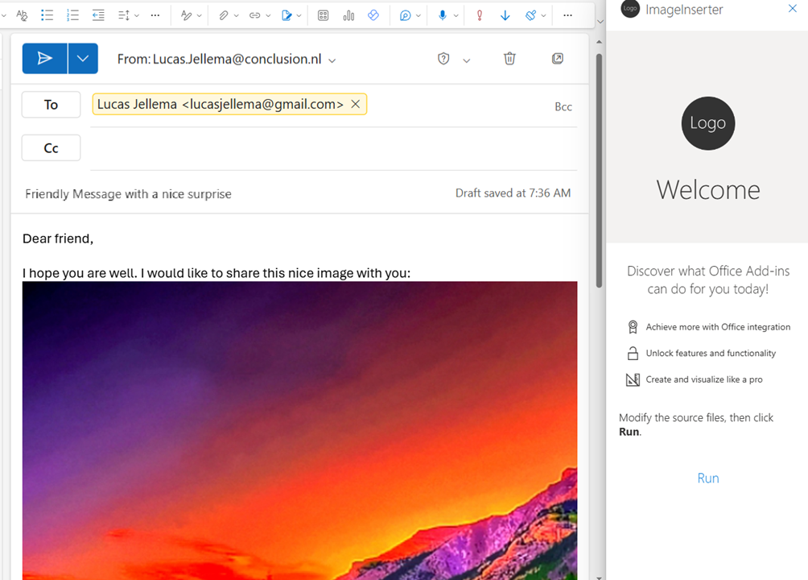
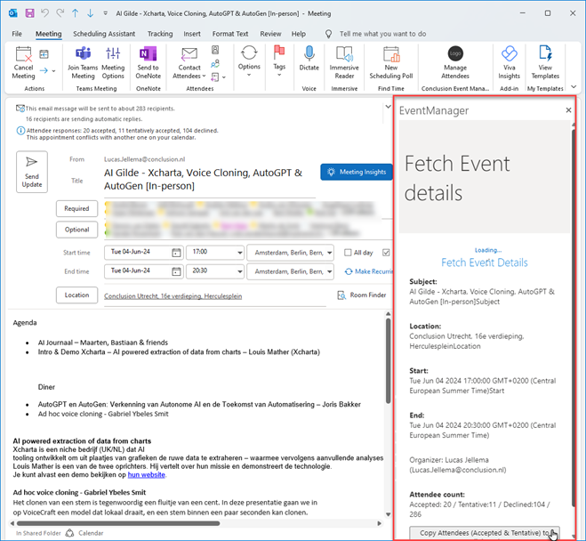
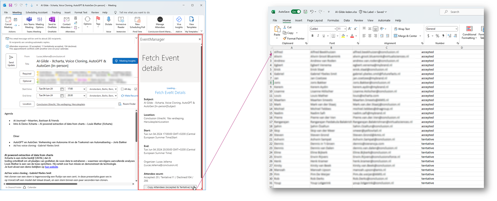

# Introduction to Outlook Addin development

This document describes some first steps to get going with development of addins for Microsoft Outlook. Addins are small web applications - HTML, CSS and JavaScrpipt - that run in an IFRAME next to the main Outlook client window - for reading or editing mail messages or calendar appointments. The JavaScript code in the addin can make use of the [Microsoft Office JavaScript API](https://learn.microsoft.com/en-us/javascript/api/outlook) to interact with the message or appointment.  


## Hello World Addin

The first addin you are going to try out is predefined by Microsoft. And it is published on GitHub Pages. You can inspect it. And you can add it to your Outlook environment, without writing any code.

Go to https://github.com/OfficeDev/Office-Add-in-samples/tree/main/Samples/hello-world/outlook-hello-world to find this addin. Check the `manifest.xml` file that configures the addin. Check the `ExtensionPoint` element in this xml file. It specifies that the addin comes with a taskpane (a side panel in Outlook client) that is based on the file `taskpane.html` and that is shown in the `MessageComposeCommandSurface` (the mail message editor).

```
 <Hosts>
      <Host xsi:type="MailHost">
        <DesktopFormFactor>

          <!-- Message Compose -->
          <ExtensionPoint xsi:type="MessageComposeCommandSurface">
            <OfficeTab id="TabDefault">
              <Group id="msgComposeCmdGroup">
                <Label resid="CommandsGroup.Label"/>
                <Control xsi:type="Button" id="msgComposeInsertGist">
                  <Label resid="TaskpaneButton.Label"/>
                  <Supertip>
                    <Title resid="TaskpaneButton.SupertipTitle"/>
                    <Description resid="TaskpaneButton.SupertipText"/>
                  </Supertip>
                  <Icon>
                    <bt:Image size="16" resid="Icon.16x16"/>
                    <bt:Image size="32" resid="Icon.32x32"/>
                    <bt:Image size="80" resid="Icon.80x80"/>
                  </Icon>
                  <Action xsi:type="ShowTaskpane">
                    <SourceLocation resid="Taskpane.Url"/>
                  </Action>
                </Control>
              </Group>
            </OfficeTab>
          </ExtensionPoint>
```

The taskpane.html file is not very exciting:
```
...
<body>
    <p>This add-in will insert the text 'Hello world!' in a new message.</p>
    <button id="helloButton">Say hello</button>

    <!-- The following image URL tracks diagnostic data for this sample add-in. Please remove the image tag if you reuse this sample in your own code project. -->
    
</body>

<script>

    Office.onReady((info) => {
        if (info.host === Office.HostType.Outlook) {
            document.getElementById("helloButton").onclick = sayHello;
        }
    });

    /**
     * Writes 'Hello world!' to a new message body.
     */
    function sayHello() {
        Office.context.mailbox.item.body.setAsync(
            "Hello world!",
            {
                coercionType: "html", // Write text as HTML
            },

            // Callback method to check that setAsync succeeded
            function (asyncResult) {
                if (asyncResult.status ==
                    Office.AsyncResultStatus.Failed) {
                    write(asyncResult.error.message);
                }
            }
        );
    }

</script>
...
```
The taskpane will show the contents *Hello World*. It will interact with the mail message when you click on the button: it inserts the text *Hello World* into the email message. To learn more about this addin, you can read [this document](https://github.com/OfficeDev/Office-Add-in-samples/blob/main/Samples/hello-world/outlook-hello-world/README.md).

To activate this addin in your Outlook environment:

* download file `manifest.xml` from https://github.com/OfficeDev/Office-Add-in-samples/blob/main/Samples/hello-world/outlook-hello-world/manifest.xml to your local disk
* navigate to https://aka.ms/olksideload - this will open a dialog in the context of Outlook to manage addins

* click on *Add a custom addin* then select *Add from file* from the dropdown 
* upload `manifest.xml`  - the addin is installed now

* after a little while, the addin is added in the overview with all addins:

* now create a new Mail message - in your local Outlook Desktop client or a fresh Web client. Then click on the *Apps* icon and find the Addin logo in the list. Click on it.

* The taskpane opens next to the new mail message. It contains a simple text and a button. Press the button. The text *Hello world!* is inserted into the mail message.


This by itself is not very useful - you have just seen the foundation for a whole range of addins you can create - to facilitate your email composition process. Note: Addins not only can edit the mail, they can also read the contents of the mail as well as other properties.

If you want to remove an addin, you (again) have to navigate to https://aka.ms/olksideload - and remove the addin in the Manage Addins dialog window.
 

## Image Inserter Addin - add image into new email 

Follow the step by step instructions in [this document](https://github.com/lucasjellema/outlook-addin/blob/main/README-image-inserter.md) to create an Outlook Addin. It acts on a message that is being composed in the message editor. When the Addin is activated, it will cause an image - and a very pretty one! - to be inserted in the message under construction at the position of the cursor.



## Event Manager - Gather Appointment Details

Note: I only got this addin to work in the "old" Windows Desktop Client - not in the Outlook web client.

This addin allows me to collect details about the positive, tentative and negative responses to an invitation to an appointment. When the button is clicked for the addin, the taskpane is shown with details for the appointment. The taskpane also contains a button that when pressed will cause the details for the RSVPs to be copied to the clipboard.


Here the button is clicked, the details are copied to the clipboard and pasted in the an Excel sheet:
 

The best way to see the addin in action is to run it locally. If you have a local clone of the GitHub repository at https://github.com/lucasjellema/outlook-addin, you can open the *EventManager* folder in VS Code.  

Open the terminal in this folder. Then run `npm start`. This will run the local web server that will serve the addin's sources. Next, the addin is configured into the local Outlook Client and then that client is opened. Switch to Outlook classic look (if your client opens in the new Windows look and feel)

Find an appointment you have created and that you have received at least one RSVP to. The Event Manager Addin button should be shown in the ribbon. Click on the button.


This brings up the taskpane. Next click on the link *Fetch Event Details*. This will populate the pane with details for the appointment and the RSVPs. You can now also press the button to copy the RSVP details in Tab Delimited Format to the clipboard. Paste the contents of the clipboard in Excel to further process these event details.

### Implementation Details

The most interesting details for this Addin are found in the taskpane.js file that contains the logic that inspects the appointment details, displays them in the taskpane and makes them available in the clipboard.  


# Resources

Outlook JavaScript API - https://learn.microsoft.com/en-us/javascript/api/outlook  

Build your first addin - https://learn.microsoft.com/en-us/office/dev/add-ins/quickstarts/outlook-quickstart?tabs=yeomangenerator

Scriptlab - https://learn.microsoft.com/en-us/office/dev/add-ins/overview/explore-with-script-lab

Tutorial: Build a message compose Outlook add-in - https://learn.microsoft.com/en-us/office/dev/add-ins/tutorials/outlook-tutorial?tabs=jsonmanifest

Tutorial: Use regular expression activation rules to show an Outlook add-in - check body of email for specific patterns and when found, turn text into link that opens addin when clicked.
https://learn.microsoft.com/en-us/office/dev/add-ins/outlook/use-regular-expressions-to-show-an-outlook-add-in

And on Activation Rules: https://learn.microsoft.com/en-us/office/dev/add-ins/outlook/activation-rules 

